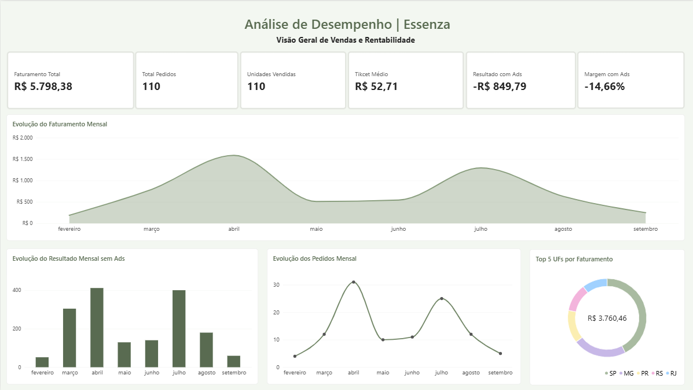
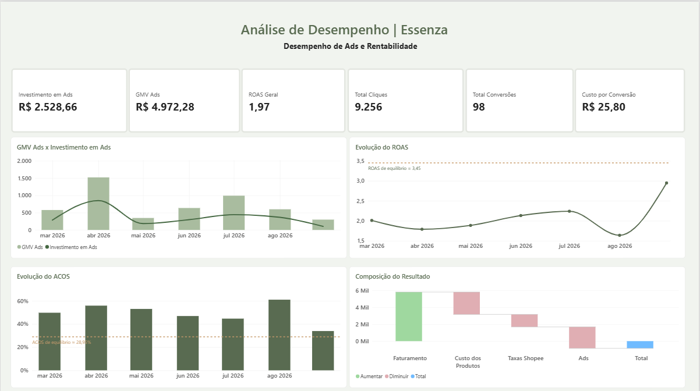

# 📊 Análise de Desempenho de E-commerce — Shopee

Projeto de análise de dados desenvolvido a partir de dados reais de uma operação de e-commerce na Shopee.

O objetivo foi analisar o desempenho de vendas, custos, rentabilidade e campanhas de Shopee Ads, transformando dados brutos em informações úteis para apoiar a tomada de decisão.

Para o desenvolvimento do projeto foram utilizados **Python, Pandas, SQL, MySQL e Power BI**, passando pelas etapas de tratamento dos dados, análise exploratória, armazenamento em banco de dados, construção de indicadores e desenvolvimento de dashboards.

> Os dados disponibilizados neste repositório foram tratados e anonimizados para preservar informações pessoais e identificadores dos compradores.

---

## 🎯 Objetivos da análise

- Analisar a evolução do faturamento e dos pedidos;
- Avaliar os principais custos da operação;
- Medir o impacto dos Shopee Ads sobre a rentabilidade;
- Acompanhar indicadores como ROAS, ACOS e custo por conversão;
- Comparar períodos de maior e menor eficiência dos anúncios;
- Identificar oportunidades de melhoria na operação.

---

## 🛠️ Tecnologias utilizadas

- **Python**
- **Pandas**
- **NumPy**
- **Matplotlib**
- **SQL**
- **MySQL**
- **Power BI**
- **Jupyter Notebook / VS Code**

---

## 🔄 Etapas do projeto

### 1. Coleta e organização dos dados

Foram utilizados relatórios de vendas e publicidade extraídos da Shopee, além dos custos relacionados à operação.

### 2. Tratamento com Python

Os dados foram tratados utilizando Python e Pandas, incluindo:

- seleção das variáveis relevantes;
- tratamento de valores ausentes;
- remoção de registros não utilizados na análise;
- padronização dos nomes das colunas;
- conversão de tipos de dados;
- tratamento de datas;
- preparação das bases para análise.

### 3. Banco de dados e SQL

Após o tratamento, os dados foram preparados para armazenamento no **MySQL**, permitindo a utilização de consultas SQL para análise e validação dos indicadores.

### 4. Análise de desempenho

Foram analisados indicadores relacionados a:

- faturamento;
- quantidade de pedidos;
- ticket médio;
- custos;
- taxas da plataforma;
- investimento em Ads;
- GMV dos anúncios;
- ROAS;
- ACOS;
- custo por conversão;
- rentabilidade.

### 5. Visualização no Power BI

Foram desenvolvidos dashboards para apresentar os principais indicadores de vendas, rentabilidade e desempenho dos anúncios.
## 📊 Dashboards

### Visão Geral de Vendas e Rentabilidade



Este dashboard apresenta os principais indicadores da operação, incluindo faturamento, pedidos, unidades vendidas, ticket médio, resultado e margem, além da evolução mensal das vendas e da distribuição do faturamento por estado.

### Desempenho de Ads e Rentabilidade



Este dashboard apresenta os principais indicadores de publicidade e rentabilidade, incluindo investimento em Ads, GMV atribuído aos anúncios, ROAS, conversões e custo por conversão. Também permite comparar a evolução do ROAS e ACOS com seus respectivos pontos de equilíbrio e visualizar o impacto dos custos sobre o resultado final.

---

## 📈 Principais resultados

No período analisado:

- **Faturamento total:** R$ 5.798,38
- **Pedidos válidos:** 110
- **Ticket médio:** R$ 52,71
- **Investimento em Ads:** R$ 2.528,66
- **GMV atribuído aos Ads:** R$ 4.972,28
- **ROAS geral:** 1,97
- **Resultado sem Ads:** R$ 1.678,87
- **Resultado com Ads:** -R$ 849,79
- **Margem sem Ads:** 28,95%
- **Margem com Ads:** -14,66%

A análise mostrou que a operação apresentava resultado positivo antes da consideração dos investimentos em publicidade. Entretanto, os custos com Ads consumiram essa margem e levaram o resultado do período analisado para o campo negativo.

Também foram identificadas diferenças relevantes na eficiência das campanhas ao longo do tempo. O período de **30/08 a 08/09** apresentou ROAS de **2,95** e ACOS de **33,93%**, enquanto o período de **01/08 a 29/08** registrou ROAS de **1,64** e ACOS de **61,00%**.

Como os períodos possuem durações diferentes, essa comparação foi utilizada como sinal de mudança de eficiência, e não como evidência de que o desempenho seria necessariamente mantido em um período mais longo.

---

## 💡 Principais insights

A análise indicou que:

- maior faturamento não significou necessariamente maior eficiência dos anúncios;
- o crescimento da receita esteve mais relacionado ao volume de vendas do que ao aumento do ticket médio;
- os Ads geraram conversões, mas o investimento realizado no período foi superior ao nível suportado pela margem da operação;
- houve períodos com melhora significativa de ROAS, ACOS e custo por conversão;
- a análise conjunta de vendas, custos e publicidade é fundamental para avaliar a rentabilidade real da operação.

---

## 📁 Estrutura do projeto

```text
Projeto_Shopee_Essenza/
│
├── dados_publicos/
│   ├── vendas_brutas.csv
│   ├── ads_brutos.csv
│   ├── custos_brutos.csv
│   ├── vendas.csv
│   ├── ads.csv
│   └── custos.csv
│
├── python/
│   └── analise_shopee_portfolio.ipynb
│
├── sql/
│
├── powerbi/
│
├── documentacao/
│   └── insights_recomendacoes.md
│
├── requirements.txt
└── README.md
```

Os arquivos `*_brutos.csv` representam as bases utilizadas como entrada no processo de tratamento do notebook público. Informações pessoais e identificadores foram removidos ou anonimizados.

Os arquivos `vendas.csv`, `ads.csv` e `custos.csv` representam as bases tratadas utilizadas nas etapas posteriores da análise.

---

## ▶️ Como executar o projeto

```markdown
Clone o repositório:

```bash
git clone https://github.com/biancaramos01/analise-dados-shopee.git
cd analise-dados-shopee
```

Depois, abra:

```text
python/analise_shopee_portfolio.ipynb
```

Para executar as etapas que utilizam MySQL, é necessário possuir uma instância local configurada. A senha não é armazenada no notebook e deve ser fornecida por meio da variável de ambiente:

```text
MYSQL_PASSWORD
```

---

## 🔒 Privacidade dos dados

Este projeto foi desenvolvido a partir de dados reais de uma operação de e-commerce.

Para publicação no portfólio, informações pessoais de compradores e identificadores sensíveis foram removidos ou anonimizados. Os arquivos originais contendo essas informações não fazem parte do repositório público.

---

## 👩‍💻 Sobre o projeto

Este projeto foi desenvolvido como parte do meu portfólio de **Análise de Dados**, com foco na aplicação prática de Python, SQL, MySQL e Power BI em um problema real de negócio.